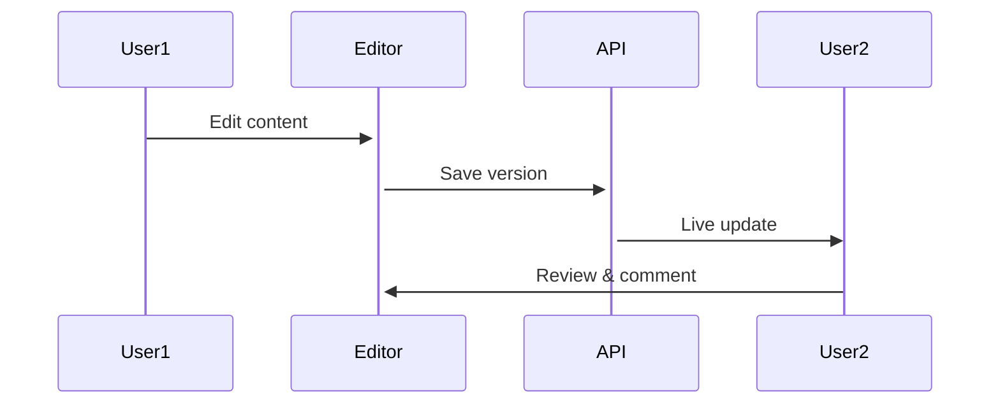

## Overview

EssayFlash provides powerful tools to create, collaborate on, and discover documentation efficiently. You manage projects with intuitive editing, track changes seamlessly, and find content quickly using advanced search and tags. These core features help teams stay organized and productive.

<Columns cols={3}>
  <Card title="Document Creation & Editing" icon="edit-3" href="#document-creation">
    Build rich documents with Markdown support and real-time previews.
  </Card>
  <Card title="Version History & Collaboration" icon="git-branch" href="#version-history">
    Track changes, revert versions, and collaborate with your team.
  </Card>
  <Card title="Search & Tagging" icon="search" href="#search-tagging">
    Locate documents instantly with full-text search and custom tags.
  </Card>
</Columns>

## Document Creation and Editing

Create new documents directly in the dashboard or via API. You edit using a WYSIWYG editor or Markdown, with live previews and syntax highlighting.

<Steps>
  <Step title="Create a Document" icon="plus">
    Navigate to your project dashboard and click "New Document".
  </Step>
  <Step title="Edit Content" icon="edit">
    Use the editor toolbar for formatting, or switch to Markdown mode.
  </Step>
  <Step title="Preview and Publish" icon="eye">
    Preview changes, then publish to make it live.
  </Step>
</Steps>

Integrate programmatically with the API:

<CodeGroup tabs="JavaScript,Python">
  ```javascript
  const response = await fetch('https://api.example.com/docs', {
    method: 'POST',
    headers: { 'Authorization': `Bearer ${YOUR_API_KEY}`, 'Content-Type': 'application/json' },
    body: JSON.stringify({
      title: 'Project Roadmap',
      content: '# Q4 Goals\n\n- Launch v2.0\n- Improve search'
    })
  });
  ```
  ```python
  import requests
  response = requests.post(
      'https://api.example.com/docs',
      headers={'Authorization': f'Bearer {YOUR_API_KEY}', 'Content-Type': 'application/json'},
      json={'title': 'Project Roadmap', 'content': '# Q4 Goals\n\n- Launch v2.0\n- Improve search'}
  )
  ```
</CodeGroup>

<Callout kind="tip">
  Enable auto-save in settings to prevent data loss during editing.
</Callout>

## Version History and Collaboration

Every edit creates a new version automatically. You review history, compare changes, and revert if needed. Invite team members for real-time collaboration.

<ParamField path="docId" param-type="string" required="true">
  Document identifier for fetching versions.
</ParamField>

<ParamField header="Authorization" param-type="string" required="true">
  Bearer token for authenticated access.
</ParamField>

Fetch versions via API:

```javascript
const versions = await fetch(`https://api.example.com/docs/{docId}/versions`, {
  headers: { 'Authorization': `Bearer ${YOUR_API_KEY}` }
});
```

<Callout kind="info">
  Collaborators see changes in real-time; use `@mentions` to notify teammates.
</Callout>



## Search Functionality and Tagging

Search across all documents with full-text queries, filters, and tags. Assign tags like `team:engineering` or `priority:high` during creation.

<Tabs>
  <Tab title="UI Search" icon="search">
    Use the global search bar. Filter by tags or date range.
  </Tab>
  <Tab title="API Search" icon="code">
    <CodeGroup tabs="Query,Tagged">
      ```javascript
      // Full-text search
      fetch(`https://api.example.com/search?q=roadmap`);
      ```
      ```javascript
      // Tag-filtered search
      fetch(`https://api.example.com/search?q=roadmap&tags=team:product`);
      ```
    </CodeGroup>
  </Tab>
</Tabs>

<ParamField query="q" param-type="string">
  Search query string.
</ParamField>

<ParamField query="tags" param-type="string">
  Comma-separated tags, e.g., `team:dev,priority:high`.
</ParamField>

Tags enhance discoverability—add them in the document sidebar.

## Next Steps

<Columns cols={2}>
  <Card title="Quickstart" icon="zap" href="/quickstart">
    Set up your first project.
  </Card>
  <Card title="Authentication" icon="shield" href="/authentication">
    Secure your API access.
  </Card>
</Columns>