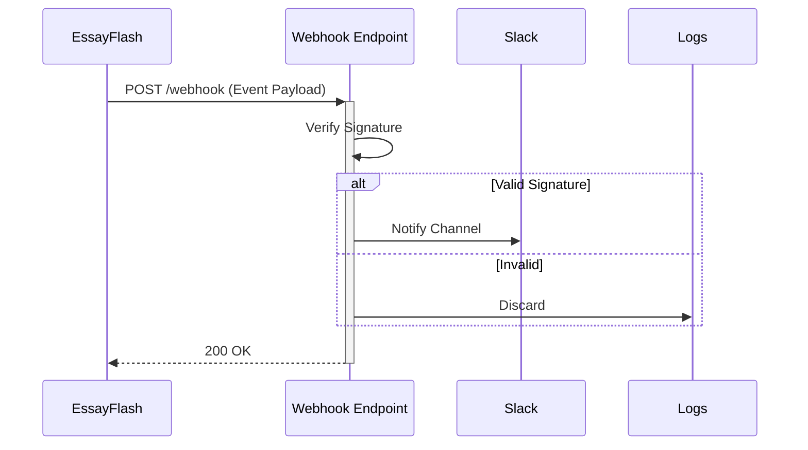

## Overview

Connect EssayFlash to your favorite tools to automate workflows, receive notifications, and extend functionality. You can integrate with third-party apps like Slack and GitHub, set up webhooks for real-time updates, or use the API for custom solutions. These integrations help you streamline documentation management without leaving your existing ecosystem.

<Callout kind="info">
  Ensure you have admin access to your EssayFlash workspace before configuring integrations.
</Callout>

## Third-Party App Integrations

EssayFlash supports seamless connections with popular services. Use these to sync documents, trigger builds, or notify teams.

<Columns cols={3}>
  <Card title="Slack" icon="message-circle" href="https://slack.com/apps">
    Send document update notifications to Slack channels instantly.
  </Card>
  <Card title="GitHub" icon="github" href="https://github.com/marketplace">
    Automatically sync documentation repos with EssayFlash pages.
  </Card>
  <Card title="Zapier" icon="zap" href="https://zapier.com/apps/essayflash">
    Build no-code automations with 5000+ apps via Zapier.
  </Card>
</Columns>

## Webhook Configuration

Webhooks enable real-time notifications when events occur in your workspace, such as page updates or user invites.

### Prerequisites
- Generate a webhook secret in your workspace settings.
- Expose a public HTTPS endpoint to receive payloads.

<Steps>
  <Step title="Create Webhook" icon="plus">
    Navigate to Workspace Settings > Integrations > Webhooks.

    Click "New Webhook" and enter your endpoint URL, e.g., `https://your-webhook-url.com/essayflash`.

    Select events like `page.updated` or `document.published`.
  </Step>
  <Step title="Verify Secret" icon="shield">
    Copy the generated signing secret. Use it to verify incoming payloads.

````javascript
// Example verification (Node.js)
const crypto = require('crypto');
const signature = 'sha256=' + crypto.createHmac('sha256', 'YOUR_WEBHOOK_SECRET').update(payload).digest('hex');
````
  </Step>
  <Step title="Test Delivery" icon="play">
    Trigger a test event from the webhook settings. Check your endpoint logs for the payload.
  </Step>
</Steps>

### Sample Payloads

<CodeGroup tabs="Page Updated,User Invited">
````json
{
  "event": "page.updated",
  "workspace_id": "ws_123abc",
  "page": {
    "id": "page_456def",
    "title": "API Reference",
    "updated_at": "2024-01-15T10:30:00Z"
  }
}
````
````json
{
  "event": "user.invited",
  "workspace_id": "ws_123abc",
  "user": {
    "email": "user@example.com",
    "role": "editor"
  }
}
````
</CodeGroup>



<ParamField path="secret" param-type="string" required="true">
  Webhook signing secret for payload verification.
</ParamField>

<ParamField header="EssayFlash-Signature" param-type="string" required="true">
  HMAC SHA256 signature of the payload.
</ParamField>

## API Access for Custom Extensions

Build custom integrations using EssayFlash's REST API at `https://api.essayflash.com/v1`.

<Tabs>
  <Tab title="List Pages" icon="list">
    Fetch all pages in your workspace.

    <Request tabs="cURL,JavaScript">
````bash
curl -X GET https://api.essayflash.com/v1/pages \
  -H "Authorization: Bearer YOUR_API_TOKEN"
````
````javascript
const response = await fetch('https://api.essayflash.com/v1/pages', {
  headers: {
    'Authorization': 'Bearer YOUR_API_TOKEN'
  }
});
const pages = await response.json();
````
    </Request>
  </Tab>
  <Tab title="Create Page" icon="plus">
    Create a new documentation page.

    <Request tabs="cURL,Python">
````bash
curl -X POST https://api.essayflash.com/v1/pages \
  -H "Authorization: Bearer YOUR_API_TOKEN" \
  -H "Content-Type: application/json" \
  -d '{"title": "New Guide", "content": "# Hello World"}'
````
````python
import requests
response = requests.post(
  'https://api.essayflash.com/v1/pages',
  headers={'Authorization': 'Bearer YOUR_API_TOKEN'},
  json={'title': 'New Guide', 'content': '# Hello World'}
)
````
    </Request>
  </Tab>
</Tabs>

<Response tabs="200,401">
````json
{
  "pages": [
    {
      "id": "page_456def",
      "title": "API Reference",
      "slug": "api-reference"
    }
  ]
}
````
````json
{
  "error": "Unauthorized",
  "message": "Invalid token"
}
````
</Response>

<Callout kind="tip">
  Generate your API token from Workspace Settings > API Access. Store it securely and rotate regularly.
</Callout>

## Next Steps

<Expandable title="Advanced Webhook Topics" default-open="false">
  Explore retry logic, batching, and custom event filters in the [full webhook docs](/webhooks).
</Expandable>

Link your integrations to supercharge your workflow. Start with webhooks for quick wins, then dive into the API for deeper customization.