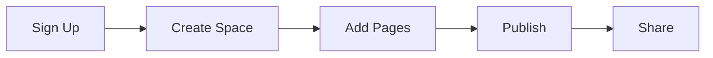

## Overview

EssayFlash helps you create, organize, and manage documentation spaces for your projects. You get a centralized hub to build knowledge bases, API references, and user guides with ease. Focus on content while EssayFlash handles the structure, search, and collaboration features.

This documentation covers everything from setup to advanced customization. Start with the quick start guide below to get your first space live in minutes.

<Callout kind="info">
  New to EssayFlash? You need an account at `https://dashboard.example.com` to begin.
</Callout>

## Key Features

EssayFlash stands out with powerful tools for documentation management:

<Columns cols={3}>
  <Card title="Dynamic Spaces" icon="book-open" href="#quick-start">
    Create unlimited documentation spaces tailored to projects, teams, or products.
  </Card>
  <Card title="Version Control" icon="git-branch" href="/changelog">
    Track changes with built-in versioning and rollback capabilities.
  </Card>
  <Card title="Search & AI" icon="search" href="#">
    Full-text search powered by AI for instant answers across your docs.
  </Card>
</Columns>

These features ensure your documentation stays organized and accessible.

## Quick Start Guide

Follow these steps to set up your first EssayFlash space:

<Steps>
  <Step title="Sign Up" icon="user-plus">
    Visit `https://dashboard.example.com/signup` and create your account. Verify your email to unlock full features.
  </Step>

  <Step title="Create a Space" icon="plus">
    From the dashboard, click "New Space". Name it (e.g., "Project Docs") and select a template.
  </Step>

  <Step title="Add Content" icon="edit-3">
    Use the editor to add pages. Here's a basic JavaScript example to embed EssayFlash docs in your app:

    <CodeGroup tabs="JavaScript,Python">
    ````javascript
    import { EssayFlashEmbed } from '@essayflash/embed-sdk';

    const embed = new EssayFlashEmbed({
      spaceId: 'your-space-id',
      apiKey: 'YOUR_API_KEY'
    });

    embed.render('#docs-container');
    ````
    ````python
    from essayflash import Embed

    embed = Embed(
        space_id='your-space-id',
        api_key='YOUR_API_KEY'
    )
    embed.render('docs_container')
    ````
    </CodeGroup>
  </Step>

  <Step title="Publish & Share" icon="globe">
    Hit "Publish" and share the public URL. Customize permissions for teams.
  </Step>
</Steps>

## Navigation

Use the sidebar to jump between sections. Key pages include:

<Tabs>
  <Tab title="Core Guides" icon="book">
    - [Quickstart](/quickstart)
    - [Authentication](/authentication)
  </Tab>
  <Tab title="Advanced" icon="settings">
    - [Configuration](/configuration)
    - [API Reference](#)
  </Tab>
</Tabs>

## Next Steps

<Columns cols={2}>
  <Card title="Explore API" icon="code" href="/authentication">
    Integrate EssayFlash with your apps using our REST API at `https://api.example.com`.
  </Card>
  <Card title="Changelog" icon="git-commit" href="/changelog">
    Stay updated with the latest releases and features.
  </Card>
</Columns>

<Callout kind="tip">
  Stuck? Check the [help center](/help-center) or contact support@essayflash.com.
</Callout>

